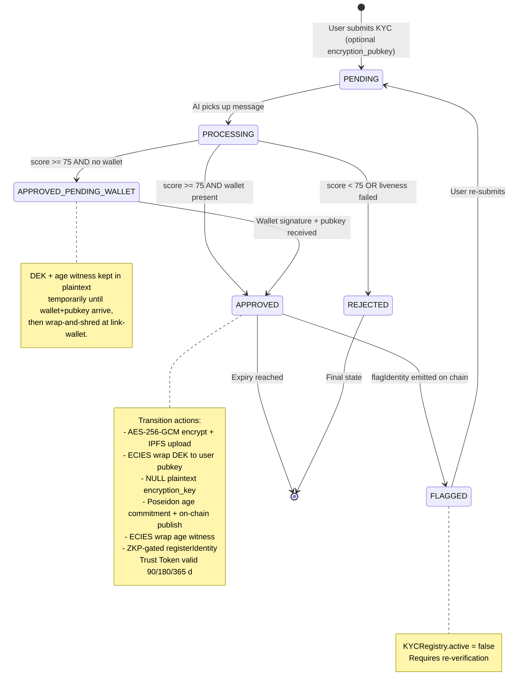

```mermaid
%% MODIFIED_CLAUDE: notes describe the wrap-and-shred + attribute commitment that now happen at the PROCESSING → APPROVED edges; also note the wallet-link path also performs the wrap.
stateDiagram-v2
      [*] --> PENDING : User submits KYC (optional encryption_pubkey)
      PENDING --> PROCESSING : AI picks up message
      PROCESSING --> APPROVED : score >= 75 AND wallet present
      PROCESSING --> APPROVED_PENDING_WALLET : score >= 75 AND no wallet
      PROCESSING --> REJECTED : score < 75 OR liveness failed
      APPROVED_PENDING_WALLET --> APPROVED : Wallet signature + pubkey received
      APPROVED --> FLAGGED : flagIdentity emitted on chain
      FLAGGED --> PENDING : User re-submits

      APPROVED --> [*] : Expiry reached
      REJECTED --> [*] : Final state

      note right of APPROVED
          Transition actions:
          - AES-256-GCM encrypt + IPFS upload
          - ECIES wrap DEK to user pubkey
          - NULL plaintext encryption_key
          - Poseidon age commitment + on-chain publish
          - ECIES wrap age witness
          - ZKP-gated registerIdentity
          Trust Token valid 90/180/365 d
      end note

      note right of APPROVED_PENDING_WALLET
          DEK + age witness kept in plaintext
          temporarily until wallet+pubkey arrive,
          then wrap-and-shred at link-wallet.
      end note

      note right of FLAGGED
          KYCRegistry.active = false
          Requires re-verification
      end note
```
