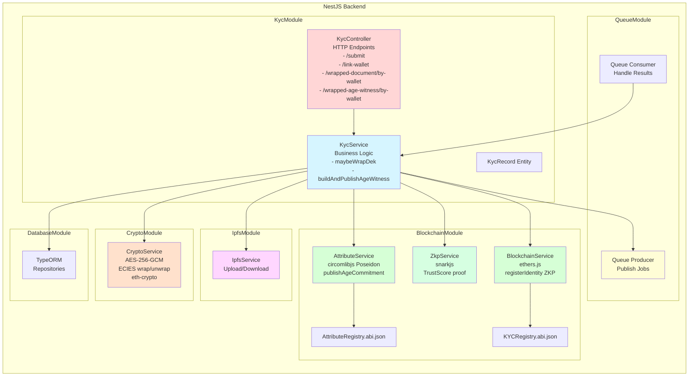

```mermaid
%% MODIFIED_CLAUDE: added ZkpService and AttributeService inside BlockchainModule; CryptoService gained ECIES wrap/unwrap; new SSI/ZKP endpoints in KycController; second contract ABI.
graph LR
      subgraph "NestJS Backend"
          subgraph "KycModule"
              KC[KycController<br/>HTTP Endpoints<br/>- /submit<br/>- /link-wallet<br/>- /wrapped-document/by-wallet<br/>- /wrapped-age-witness/by-wallet]
              KS[KycService<br/>Business Logic<br/>- maybeWrapDek<br/>- buildAndPublishAgeWitness]
              KE[KycRecord Entity]
          end

          subgraph "QueueModule"
              QP[Queue Producer<br/>Publish Jobs]
              QC[Queue Consumer<br/>Handle Results]
          end

          subgraph "BlockchainModule"
              BS[BlockchainService<br/>ethers.js<br/>registerIdentity ZKP]
              ZS[ZkpService<br/>snarkjs<br/>TrustScore proof]
              AS[AttributeService<br/>circomlibjs Poseidon<br/>publishAgeCommitment]
              ABI1[KYCRegistry.abi.json]
              ABI2[AttributeRegistry.abi.json]
          end

          subgraph "IpfsModule"
              IS[IpfsService<br/>Upload/Download]
          end

          subgraph "CryptoModule"
              CS[CryptoService<br/>AES-256-GCM<br/>ECIES wrap/unwrap<br/>eth-crypto]
          end

          subgraph "DatabaseModule"
              TR[TypeORM<br/>Repositories]
          end
      end

      KC --> KS
      KS --> QP
      KS --> BS
      KS --> ZS
      KS --> AS
      KS --> IS
      KS --> CS
      KS --> TR
      QC --> KS
      BS --> ABI1
      AS --> ABI2

      style KC fill:#ffd6d6
      style KS fill:#d6f5ff
      style QP fill:#fffdd6
      style BS fill:#d6ffd6
      style ZS fill:#d6ffe1
      style AS fill:#d6ffd6
      style IS fill:#ffd6ff
      style CS fill:#ffe1cc
```
