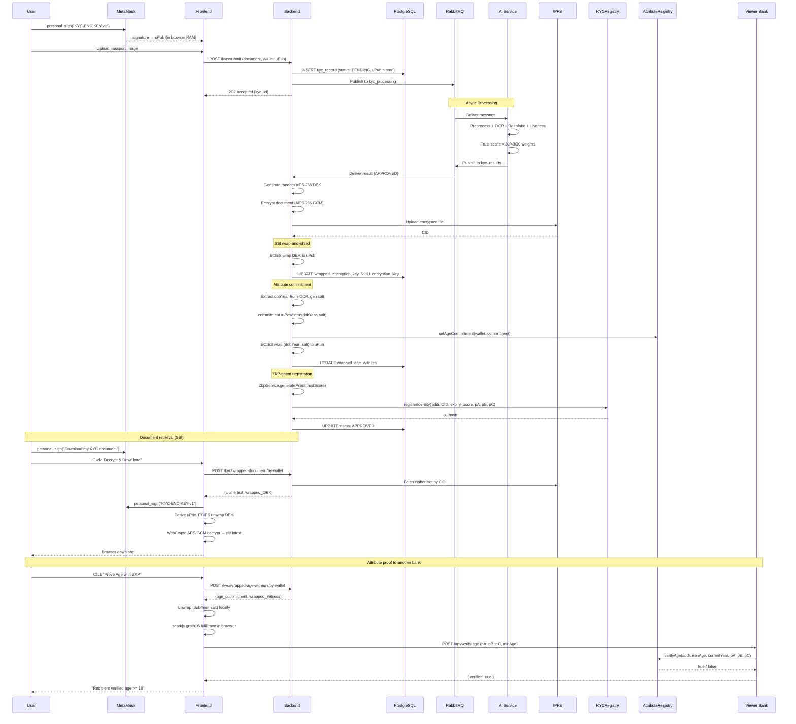

```mermaid
%% MODIFIED_CLAUDE: approval path now wraps DEK to user pubkey and publishes age commitment; download is split into wrapped fetch + in-browser decrypt; new ZKP attribute-proof subflow.
sequenceDiagram
      participant User
      participant Wallet as MetaMask
      participant Frontend
      participant Backend
      participant DB as PostgreSQL
      participant MQ as RabbitMQ
      participant AI as AI Service
      participant IPFS
      participant KR as KYCRegistry
      participant AR as AttributeRegistry
      participant VB as Viewer Bank

      User->>Wallet: personal_sign("KYC-ENC-KEY-v1")
      Wallet-->>Frontend: signature → uPub (in browser RAM)
      User->>Frontend: Upload passport image
      Frontend->>Backend: POST /kyc/submit (document, wallet, uPub)
      Backend->>DB: INSERT kyc_record (status: PENDING, uPub stored)
      Backend->>MQ: Publish to kyc_processing
      Backend-->>Frontend: 202 Accepted {kyc_id}

      Note over AI,MQ: Async Processing
      MQ->>AI: Deliver message
      AI->>AI: Preprocess + OCR + Deepfake + Liveness
      AI->>AI: Trust score = 30/40/30 weights
      AI->>MQ: Publish to kyc_results

      MQ->>Backend: Deliver result (APPROVED)
      Backend->>Backend: Generate random AES-256 DEK
      Backend->>Backend: Encrypt document (AES-256-GCM)
      Backend->>IPFS: Upload encrypted file
      IPFS-->>Backend: CID

      Note over Backend: SSI wrap-and-shred
      Backend->>Backend: ECIES wrap DEK to uPub
      Backend->>DB: UPDATE wrapped_encryption_key, NULL encryption_key

      Note over Backend: Attribute commitment
      Backend->>Backend: Extract dobYear from OCR, gen salt
      Backend->>Backend: commitment = Poseidon(dobYear, salt)
      Backend->>AR: setAgeCommitment(wallet, commitment)
      Backend->>Backend: ECIES wrap (dobYear, salt) to uPub
      Backend->>DB: UPDATE wrapped_age_witness

      Note over Backend: ZKP-gated registration
      Backend->>Backend: ZkpService.generateProof(trustScore)
      Backend->>KR: registerIdentity(addr, CID, expiry, score, pA, pB, pC)
      KR-->>Backend: tx_hash
      Backend->>DB: UPDATE status: APPROVED

      Note over User,Backend: Document retrieval (SSI)
      User->>Wallet: personal_sign("Download my KYC document")
      User->>Frontend: Click "Decrypt & Download"
      Frontend->>Backend: POST /kyc/wrapped-document/by-wallet
      Backend->>IPFS: Fetch ciphertext by CID
      Backend-->>Frontend: {ciphertext, wrapped_DEK}
      Frontend->>Wallet: personal_sign("KYC-ENC-KEY-v1")
      Frontend->>Frontend: Derive uPriv, ECIES unwrap DEK
      Frontend->>Frontend: WebCrypto AES-GCM decrypt → plaintext
      Frontend-->>User: Browser download

      Note over User,VB: Attribute proof to another bank
      User->>Frontend: Click "Prove Age with ZKP"
      Frontend->>Backend: POST /kyc/wrapped-age-witness/by-wallet
      Backend-->>Frontend: {age_commitment, wrapped_witness}
      Frontend->>Frontend: Unwrap (dobYear, salt) locally
      Frontend->>Frontend: snarkjs.groth16.fullProve in browser
      Frontend->>VB: POST /api/verify-age {pA, pB, pC, minAge}
      VB->>AR: verifyAge(addr, minAge, currentYear, pA, pB, pC)
      AR-->>VB: true / false
      VB-->>Frontend: { verified: true }
      Frontend-->>User: "Recipient verified age >= 18"
```
