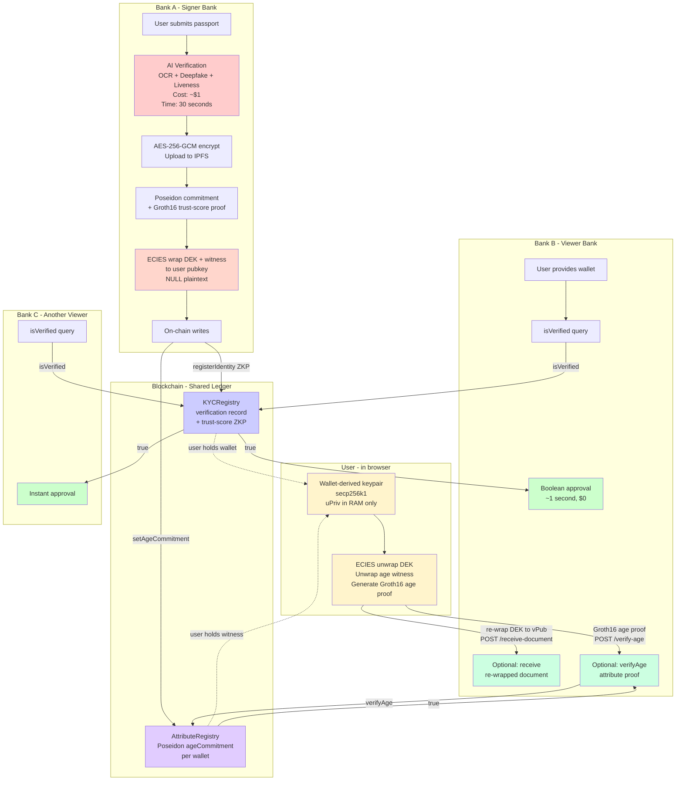

```mermaid
%% MODIFIED_CLAUDE: replaced bank-to-bank plaintext share with user-mediated re-wrap; added attribute-level age-proof flow; viewer banks call verifyAge in addition to isVerified.
graph TB
      subgraph "Bank A - Signer Bank"
          U1[User submits passport]
          A1[AI Verification<br/>OCR + Deepfake + Liveness<br/>Cost: ~$1<br/>Time: 30 seconds]
          A2[AES-256-GCM encrypt<br/>Upload to IPFS]
          A3[Poseidon commitment<br/>+ Groth16 trust-score proof]
          A4[ECIES wrap DEK + witness<br/>to user pubkey<br/>NULL plaintext]
          A5[On-chain writes]
      end

      subgraph "Blockchain - Shared Ledger"
          KR[KYCRegistry<br/>verification record<br/>+ trust-score ZKP]
          AR[AttributeRegistry<br/>Poseidon ageCommitment<br/>per wallet]
      end

      subgraph "User - in browser"
          UB[Wallet-derived keypair<br/>secp256k1<br/>uPriv in RAM only]
          UNW[ECIES unwrap DEK<br/>Unwrap age witness<br/>Generate Groth16 age proof]
      end

      subgraph "Bank B - Viewer Bank"
          B1[User provides wallet]
          B2[isVerified query]
          B3[Boolean approval<br/>~1 second, $0]
          B4[Optional: receive<br/>re-wrapped document]
          B5[Optional: verifyAge<br/>attribute proof]
      end

      subgraph "Bank C - Another Viewer"
          C1[isVerified query]
          C2[Instant approval]
      end

      U1 --> A1
      A1 --> A2
      A2 --> A3
      A3 --> A4
      A4 --> A5
      A5 -->|registerIdentity ZKP| KR
      A5 -->|setAgeCommitment| AR

      KR -.->|user holds wallet| UB
      AR -.->|user holds witness| UB
      UB --> UNW

      B1 --> B2
      B2 -->|isVerified| KR
      KR -->|true| B3

      UNW -->|re-wrap DEK to vPub<br/>POST /receive-document| B4
      UNW -->|Groth16 age proof<br/>POST /verify-age| B5
      B5 -->|verifyAge| AR
      AR -->|true| B5

      C1 -->|isVerified| KR
      KR -->|true| C2

      style A1 fill:#ffcccc
      style A4 fill:#ffd6cc
      style B3 fill:#ccffcc
      style B4 fill:#ccffe1
      style B5 fill:#ccffe1
      style C2 fill:#ccffcc
      style KR fill:#ccccff
      style AR fill:#e1ccff
      style UB fill:#fff4cc
      style UNW fill:#fff4cc
```
