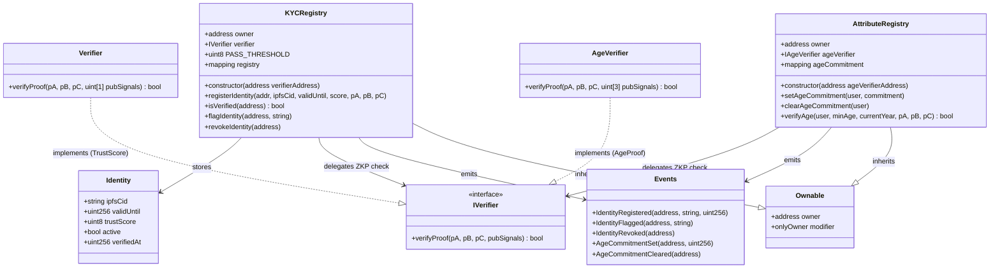

```mermaid
%% MODIFIED_CLAUDE: KYCRegistry constructor takes verifier address and registerIdentity takes ZKP proof params; added AttributeRegistry, AgeVerifier, Verifier (trust score), and IVerifier interface.
classDiagram
      class KYCRegistry {
          +address owner
          +IVerifier verifier
          +uint8 PASS_THRESHOLD
          +mapping registry
          +constructor(address verifierAddress)
          +registerIdentity(addr, ipfsCid, validUntil, score, pA, pB, pC)
          +isVerified(address) bool
          +flagIdentity(address, string)
          +revokeIdentity(address)
      }

      class Identity {
          +string ipfsCid
          +uint256 validUntil
          +uint8 trustScore
          +bool active
          +uint256 verifiedAt
      }

      class AttributeRegistry {
          +address owner
          +IAgeVerifier ageVerifier
          +mapping ageCommitment
          +constructor(address ageVerifierAddress)
          +setAgeCommitment(user, commitment)
          +clearAgeCommitment(user)
          +verifyAge(user, minAge, currentYear, pA, pB, pC) bool
      }

      class IVerifier {
          <<interface>>
          +verifyProof(pA, pB, pC, pubSignals) bool
      }

      class Verifier {
          +verifyProof(pA, pB, pC, uint[1] pubSignals) bool
      }

      class AgeVerifier {
          +verifyProof(pA, pB, pC, uint[3] pubSignals) bool
      }

      class Events {
          +IdentityRegistered(address, string, uint256)
          +IdentityFlagged(address, string)
          +IdentityRevoked(address)
          +AgeCommitmentSet(address, uint256)
          +AgeCommitmentCleared(address)
      }

      class Ownable {
          +address owner
          +onlyOwner modifier
      }

      KYCRegistry --> Identity : stores
      KYCRegistry --> IVerifier : delegates ZKP check
      KYCRegistry --> Events : emits
      KYCRegistry --|> Ownable : inherits

      AttributeRegistry --> IVerifier : delegates ZKP check
      AttributeRegistry --> Events : emits
      AttributeRegistry --|> Ownable : inherits

      Verifier ..|> IVerifier : implements (TrustScore)
      AgeVerifier ..|> IVerifier : implements (AgeProof)
```
