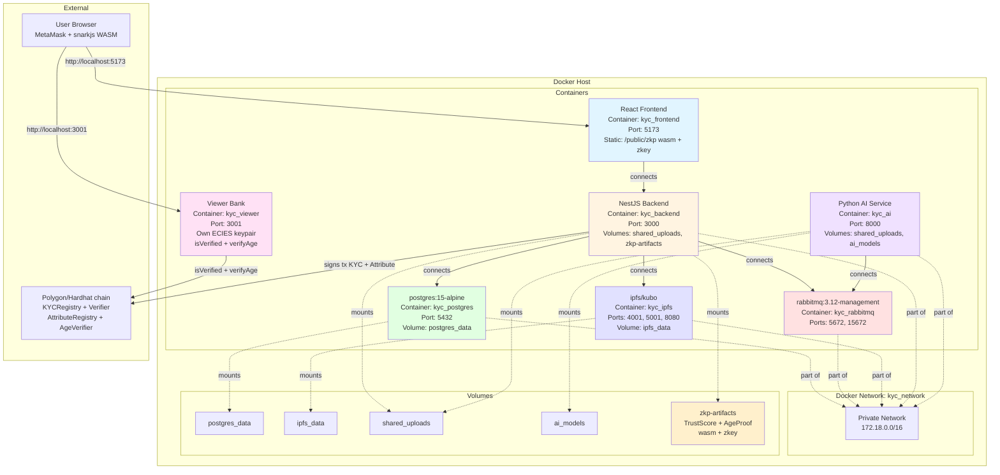

```mermaid
%% MODIFIED_CLAUDE: viewer-bank now holds its own ECIES keypair, accepts re-wrapped docs and verifyAge calls; backend mounts zkp-artifacts; frontend serves zkp wasm/zkey files.
graph TB
      subgraph "Docker Host"
          subgraph "Containers"
              C1[postgres:15-alpine<br/>Container: kyc_postgres<br/>Port: 5432<br/>Volume: postgres_data]
              C2[rabbitmq:3.12-management<br/>Container: kyc_rabbitmq<br/>Ports: 5672, 15672]
              C3[ipfs/kubo<br/>Container: kyc_ipfs<br/>Ports: 4001, 5001, 8080<br/>Volume: ipfs_data]
              C4[NestJS Backend<br/>Container: kyc_backend<br/>Port: 3000<br/>Volumes: shared_uploads, zkp-artifacts]
              C5[Python AI Service<br/>Container: kyc_ai<br/>Port: 8000<br/>Volumes: shared_uploads, ai_models]
              C6[React Frontend<br/>Container: kyc_frontend<br/>Port: 5173<br/>Static: /public/zkp wasm + zkey]
              C7[Viewer Bank<br/>Container: kyc_viewer<br/>Port: 3001<br/>Own ECIES keypair<br/>isVerified + verifyAge]
          end

          subgraph "Docker Network: kyc_network"
              NET[Private Network<br/>172.18.0.0/16]
          end

          subgraph "Volumes"
              V1[postgres_data]
              V2[ipfs_data]
              V3[shared_uploads]
              V4[ai_models]
              V5[zkp-artifacts<br/>TrustScore + AgeProof<br/>wasm + zkey]
          end
      end

      subgraph "External"
          BC[Polygon/Hardhat chain<br/>KYCRegistry + Verifier<br/>AttributeRegistry + AgeVerifier]
          USER[User Browser<br/>MetaMask + snarkjs WASM]
      end

      C1 -.->|mounts| V1
      C3 -.->|mounts| V2
      C4 -.->|mounts| V3
      C4 -.->|mounts| V5
      C5 -.->|mounts| V3
      C5 -.->|mounts| V4

      C4 -->|connects| C1
      C4 -->|connects| C2
      C4 -->|connects| C3
      C5 -->|connects| C2
      C6 -->|connects| C4
      C7 -->|isVerified + verifyAge| BC

      C4 -->|signs tx KYC + Attribute| BC
      USER -->|http://localhost:5173| C6
      USER -->|http://localhost:3001| C7

      C1 -.->|part of| NET
      C2 -.->|part of| NET
      C3 -.->|part of| NET
      C4 -.->|part of| NET
      C5 -.->|part of| NET

      style C1 fill:#e1ffe1
      style C2 fill:#ffe1e1
      style C3 fill:#e1e1ff
      style C4 fill:#fff4e1
      style C5 fill:#f0e1ff
      style C6 fill:#e1f5ff
      style C7 fill:#ffe1f5
      style V5 fill:#fff0cc
```
