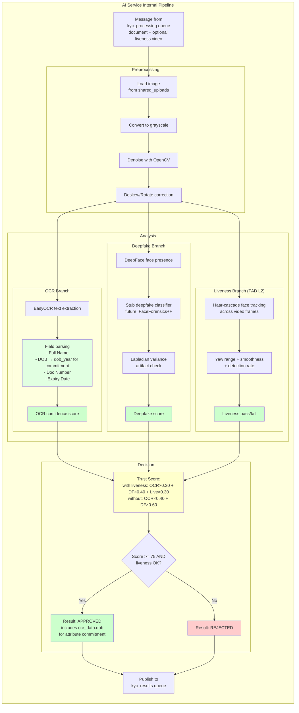

```mermaid
%% MODIFIED_CLAUDE: added liveness branch (Haar cascade), corrected trust-score formula with liveness weights, marked dob_year as feeding the downstream Poseidon attribute commitment.
graph LR
      subgraph "AI Service Internal Pipeline"
          IN[Message from<br/>kyc_processing queue<br/>document + optional liveness video]

          subgraph "Preprocessing"
              P1[Load image<br/>from shared_uploads]
              P2[Convert to grayscale]
              P3[Denoise with OpenCV]
              P4[Deskew/Rotate correction]
          end

          subgraph "Analysis"
              subgraph "OCR Branch"
                  O1[EasyOCR text extraction]
                  O2[Field parsing<br/>- Full Name<br/>- DOB → dob_year for commitment<br/>- Doc Number<br/>- Expiry Date]
                  O3[OCR confidence score]
              end

              subgraph "Deepfake Branch"
                  D1[DeepFace face presence]
                  D2[Stub deepfake classifier<br/>future: FaceForensics++]
                  D3[Laplacian variance<br/>artifact check]
                  D4[Deepfake score]
              end

              subgraph "Liveness Branch (PAD L2)"
                  L1[Haar-cascade face tracking<br/>across video frames]
                  L2[Yaw range + smoothness<br/>+ detection rate]
                  L3[Liveness pass/fail]
              end
          end

          subgraph "Decision"
              T1[Trust Score:<br/>with liveness: OCR×0.30 + DF×0.40 + Live×0.30<br/>without: OCR×0.40 + DF×0.60]
              T2{Score >= 75 AND<br/>liveness OK?}
              R1[Result: APPROVED<br/>includes ocr_data.dob<br/>for attribute commitment]
              R2[Result: REJECTED]
          end

          OUT[Publish to<br/>kyc_results queue]
      end

      IN --> P1 --> P2 --> P3 --> P4

      P4 --> O1
      P4 --> D1
      P4 --> L1

      O1 --> O2 --> O3
      D1 --> D2 --> D3 --> D4
      L1 --> L2 --> L3

      O3 --> T1
      D4 --> T1
      L3 --> T1

      T1 --> T2
      T2 -->|Yes| R1
      T2 -->|No| R2

      R1 --> OUT
      R2 --> OUT

      style O3 fill:#ccffcc
      style D4 fill:#ccffcc
      style L3 fill:#ccffcc
      style T1 fill:#ffffcc
      style R1 fill:#ccffcc
      style R2 fill:#ffcccc
      style O2 fill:#e1ffe1
```
