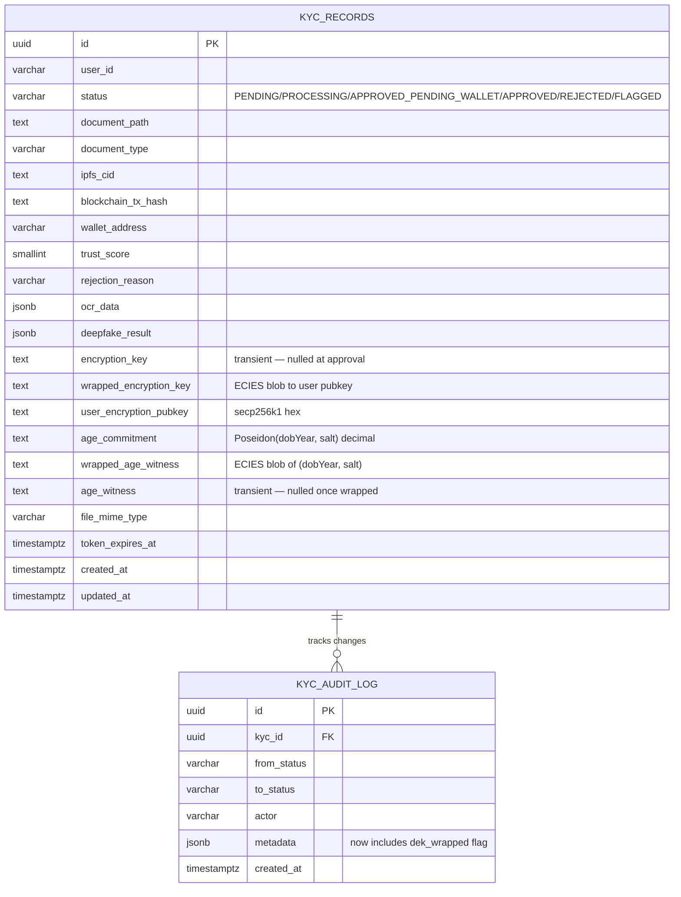

```mermaid
%% MODIFIED_CLAUDE: added wrapped_encryption_key, user_encryption_pubkey, age_commitment, wrapped_age_witness, age_witness columns. Plaintext encryption_key now transient (nulled at approval).
erDiagram
      KYC_RECORDS {
          uuid id PK
          varchar user_id
          varchar status "PENDING/PROCESSING/APPROVED_PENDING_WALLET/APPROVED/REJECTED/FLAGGED"
          text document_path
          varchar document_type
          text ipfs_cid
          text blockchain_tx_hash
          varchar wallet_address
          smallint trust_score
          varchar rejection_reason
          jsonb ocr_data
          jsonb deepfake_result
          text encryption_key "transient — nulled at approval"
          text wrapped_encryption_key "ECIES blob to user pubkey"
          text user_encryption_pubkey "secp256k1 hex"
          text age_commitment "Poseidon(dobYear, salt) decimal"
          text wrapped_age_witness "ECIES blob of (dobYear, salt)"
          text age_witness "transient — nulled once wrapped"
          varchar file_mime_type
          timestamptz token_expires_at
          timestamptz created_at
          timestamptz updated_at
      }

      KYC_AUDIT_LOG {
          uuid id PK
          uuid kyc_id FK
          varchar from_status
          varchar to_status
          varchar actor
          jsonb metadata "now includes dek_wrapped flag"
          timestamptz created_at
      }

      KYC_RECORDS ||--o{ KYC_AUDIT_LOG : "tracks changes"
```
