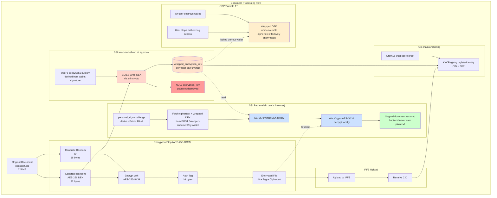

```mermaid
%% MODIFIED_CLAUDE: replaced "store key in DB" with envelope encryption + wrap-and-shred at approval; retrieval is now ciphertext + wrapped DEK fetch followed by in-browser decryption.
graph TB
      subgraph "Document Processing Flow"
          DOC[Original Document<br/>passport.jpg<br/>2.5 MB]

          subgraph "Encryption Step (AES-256-GCM)"
              KEY[Generate Random<br/>AES-256 DEK<br/>32 bytes]
              IV[Generate Random<br/>IV<br/>16 bytes]
              ENC[Encrypt with<br/>AES-256-GCM]
              TAG[Auth Tag<br/>16 bytes]
              CIPHER[Encrypted File<br/>IV + Tag + Ciphertext]
          end

          subgraph "IPFS Upload"
              UP[Upload to IPFS]
              CID[Receive CID]
          end

          subgraph "SSI wrap-and-shred at approval"
              UPK[User's secp256k1 pubkey<br/>derived from wallet signature]
              WRAP[ECIES wrap DEK<br/>via eth-crypto]
              WRAPPED[(wrapped_encryption_key<br/>only user can unwrap)]
              SHRED[NULL encryption_key<br/>plaintext destroyed]
          end

          subgraph "On-chain anchoring"
              ZKP[Groth16 trust-score proof]
              REG[KYCRegistry.registerIdentity<br/>CID + ZKP]
          end

          subgraph "SSI Retrieval (in user's browser)"
              SIG[personal_sign challenge<br/>derive uPriv in RAM]
              FETCH_C[Fetch ciphertext + wrapped DEK<br/>from POST /wrapped-document/by-wallet]
              UNW[ECIES unwrap DEK locally]
              DEC[WebCrypto AES-GCM decrypt locally]
              ORIG[Original document restored<br/>backend never saw plaintext]
          end

          subgraph "GDPR Article 17"
              ERA1[User stops authorizing access]
              ERA2[Or user destroys wallet]
              ERA3[Wrapped DEK unrecoverable<br/>ciphertext effectively anonymous]
          end
      end

      DOC --> KEY
      KEY --> ENC
      DOC --> IV
      IV --> ENC
      ENC --> TAG
      TAG --> CIPHER
      CIPHER --> UP
      UP --> CID

      KEY --> WRAP
      UPK --> WRAP
      WRAP --> WRAPPED
      WRAP --> SHRED

      CID --> REG
      WRAPPED --> REG
      ZKP --> REG

      SIG --> FETCH_C
      FETCH_C --> UNW
      WRAPPED -.->|read| UNW
      CIPHER -.->|fetched| DEC
      UNW --> DEC
      DEC --> ORIG

      WRAPPED -.->|locked without wallet| ERA3
      ERA1 --> ERA3
      ERA2 --> ERA3

      style WRAP fill:#ffd6cc
      style WRAPPED fill:#ffe1cc
      style SHRED fill:#ff9999
      style UNW fill:#cce1ff
      style DEC fill:#cce1ff
      style ORIG fill:#ccffcc
      style ERA3 fill:#ffeecc
```
