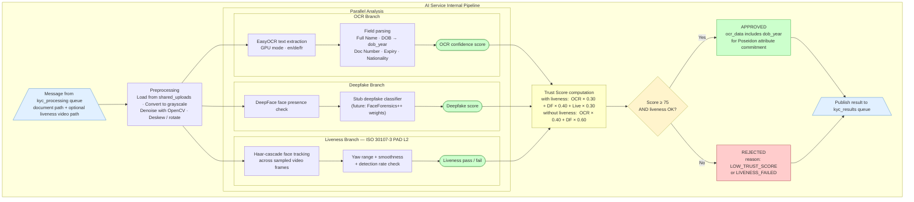

```mermaid
%% MODIFIED_CLAUDE: switched from LR to TB, collapsed preprocessing into one node, three analysis branches side-by-side for readable portrait layout in PDF.
graph TB
    subgraph AI_SERVICE["AI Service Internal Pipeline"]
        IN[/"Message from kyc_processing queue\ndocument path + optional liveness video path"\]

        P["Preprocessing\nLoad from shared_uploads · Convert to grayscale\nDenoise with OpenCV · Deskew / rotate"]

        subgraph ANALYSIS["Parallel Analysis"]
            subgraph OCR["OCR Branch"]
                O1["EasyOCR text extraction\nGPU mode · en/de/fr"]
                O2["Field parsing\nFull Name · DOB → dob_year\nDoc Number · Expiry · Nationality"]
                O3(["OCR confidence score"])
            end

            subgraph DEEP["Deepfake Branch"]
                D1["DeepFace face presence check"]
                D2["Stub deepfake classifier\n(future: FaceForensics++ weights)"]
                D3(["Deepfake score"])
            end

            subgraph LIVE["Liveness Branch — ISO 30107-3 PAD L2"]
                L1["Haar-cascade face tracking\nacross sampled video frames"]
                L2["Yaw range + smoothness\n+ detection rate check"]
                L3(["Liveness pass / fail"])
            end
        end

        T1["Trust Score computation\nwith liveness:  OCR × 0.30 + DF × 0.40 + Live × 0.30\nwithout liveness:  OCR × 0.40 + DF × 0.60"]
        T2{"Score ≥ 75\nAND liveness OK?"}
        R1["APPROVED\nocr_data includes dob_year\nfor Poseidon attribute commitment"]
        R2["REJECTED\nreason: LOW_TRUST_SCORE\nor LIVENESS_FAILED"]
        OUT[/"Publish result to kyc_results queue"\]
    end

    IN --> P
    P --> O1
    P --> D1
    P --> L1

    O1 --> O2 --> O3
    D1 --> D2 --> D3
    L1 --> L2 --> L3

    O3 --> T1
    D3 --> T1
    L3 --> T1

    T1 --> T2
    T2 -->|Yes| R1
    T2 -->|No| R2
    R1 --> OUT
    R2 --> OUT

    style O3 fill:#ccffcc,stroke:#66aa66
    style D3 fill:#ccffcc,stroke:#66aa66
    style L3 fill:#ccffcc,stroke:#66aa66
    style T1 fill:#ffffcc,stroke:#aaaa44
    style T2 fill:#fff4cc,stroke:#aaaa44
    style R1 fill:#ccffcc,stroke:#44aa44
    style R2 fill:#ffcccc,stroke:#aa4444
    style IN fill:#e1f0ff,stroke:#4488cc
    style OUT fill:#e1f0ff,stroke:#4488cc
```
