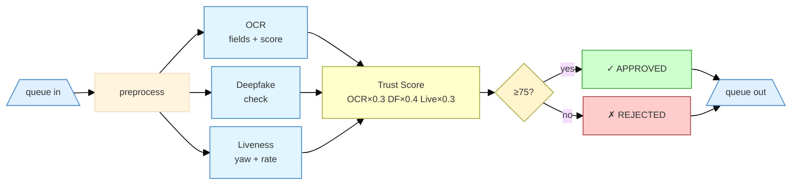

```mermaid
%%{init: {'theme':'base', 'themeVariables': {'fontSize':'11px'}, 'flowchart': {'nodeSpacing':10, 'rankSpacing':18}}}%%
graph LR

    IN[/"queue in"\] --> P["preprocess"] --> O & D & L

    O["OCR\nfields + score"]
    D["Deepfake\ncheck"]
    L["Liveness\nyaw + rate"]

    O & D & L --> T["Trust Score\nOCR×0.3 DF×0.4 Live×0.3"]
    T --> R{"≥75?"}
    R -- yes --> A["✓ APPROVED"]
    R -- no  --> X["✗ REJECTED"]
    A & X --> OUT[/"queue out"\]

    style O fill:#e1f5ff,stroke:#4488cc,stroke-width:1px
    style D fill:#e1f5ff,stroke:#4488cc,stroke-width:1px
    style L fill:#e1f5ff,stroke:#4488cc,stroke-width:1px
    style T fill:#ffffcc,stroke:#aaaa44,stroke-width:1px
    style R fill:#fff4cc,stroke:#aaaa44,stroke-width:1px
    style A fill:#ccffcc,stroke:#44aa44,stroke-width:1px
    style X fill:#ffcccc,stroke:#aa4444,stroke-width:1px
    style IN  fill:#e1f0ff,stroke:#4488cc,stroke-width:1px
    style OUT fill:#e1f0ff,stroke:#4488cc,stroke-width:1px

```
