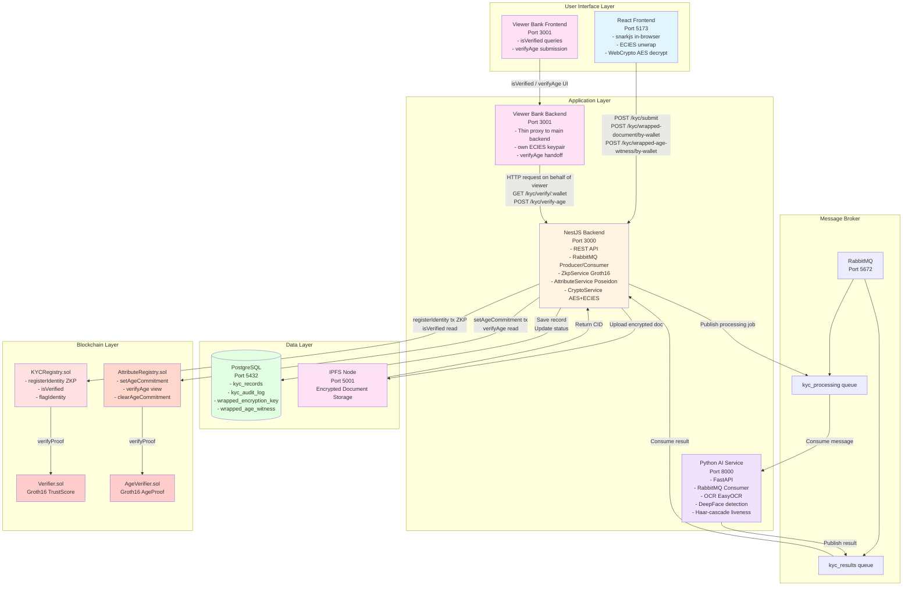

```mermaid
%% MODIFIED_CLAUDE: viewer-bank backend now routes blockchain reads through the main backend instead of querying the chain directly; added AttributeRegistry/AgeVerifier; in-browser snarkjs + ECIES on the frontend.
graph TB
      subgraph "User Interface Layer"
          FE[React Frontend<br/>Port 5173<br/>- snarkjs in-browser<br/>- ECIES unwrap<br/>- WebCrypto AES decrypt]
          VFE[Viewer Bank Frontend<br/>Port 3001<br/>- isVerified queries<br/>- verifyAge submission]
      end

      subgraph "Application Layer"
          BE[NestJS Backend<br/>Port 3000<br/>- REST API<br/>- RabbitMQ Producer/Consumer<br/>- ZkpService Groth16<br/>- AttributeService Poseidon<br/>- CryptoService AES+ECIES]
          AI[Python AI Service<br/>Port 8000<br/>- FastAPI<br/>- RabbitMQ Consumer<br/>- OCR EasyOCR<br/>- DeepFace detection<br/>- Haar-cascade liveness]
          VBE[Viewer Bank Backend<br/>Port 3001<br/>- Thin proxy to main backend<br/>- own ECIES keypair<br/>- verifyAge handoff]
      end

      subgraph "Message Broker"
          MQ[RabbitMQ<br/>Port 5672]
          Q1[kyc_processing queue]
          Q2[kyc_results queue]
          MQ --> Q1
          MQ --> Q2
      end

      subgraph "Data Layer"
          DB[(PostgreSQL<br/>Port 5432<br/>- kyc_records<br/>- kyc_audit_log<br/>- wrapped_encryption_key<br/>- wrapped_age_witness)]
          IPFS[IPFS Node<br/>Port 5001<br/>Encrypted Document Storage]
      end

      subgraph "Blockchain Layer"
          KR[KYCRegistry.sol<br/>- registerIdentity ZKP<br/>- isVerified<br/>- flagIdentity]
          AR[AttributeRegistry.sol<br/>- setAgeCommitment<br/>- verifyAge view<br/>- clearAgeCommitment]
          V1[Verifier.sol<br/>Groth16 TrustScore]
          V2[AgeVerifier.sol<br/>Groth16 AgeProof]
      end

      FE -->|POST /kyc/submit<br/>POST /kyc/wrapped-document/by-wallet<br/>POST /kyc/wrapped-age-witness/by-wallet| BE
      VFE -->|isVerified / verifyAge UI| VBE
      VBE -->|HTTP request on behalf of viewer<br/>GET /kyc/verify/:wallet<br/>POST /kyc/verify-age| BE
      BE -->|Save record<br/>Update status| DB
      BE -->|Publish processing job| Q1
      Q1 -->|Consume message| AI
      AI -->|Publish result| Q2
      Q2 -->|Consume result| BE
      BE -->|Upload encrypted doc| IPFS
      IPFS -->|Return CID| BE
      BE -->|registerIdentity tx ZKP<br/>isVerified read| KR
      BE -->|setAgeCommitment tx<br/>verifyAge read| AR
      KR -->|verifyProof| V1
      AR -->|verifyProof| V2

      style FE fill:#e1f5ff
      style VFE fill:#ffe1f5
      style BE fill:#fff4e1
      style AI fill:#f0e1ff
      style VBE fill:#ffe1f5
      style DB fill:#e1ffe1
      style IPFS fill:#ffe1f5
      style KR fill:#ffe1e1
      style AR fill:#ffd6cc
      style V1 fill:#ffcccc
      style V2 fill:#ffcccc
```
