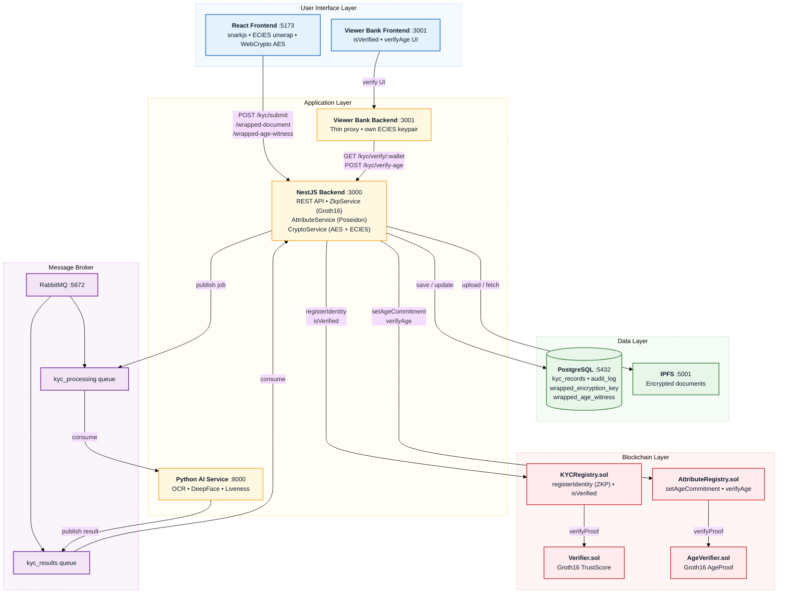

```mermaid
%%{init: {'theme':'base', 'themeVariables': {'fontSize':'14px', 'fontFamily':'Arial'}, 'flowchart': {'nodeSpacing':25, 'rankSpacing':50}}}%%
graph TB
    subgraph UI["User Interface Layer"]
        direction TB
        FE["<b>React Frontend</b> :5173<br/>snarkjs • ECIES unwrap • WebCrypto AES"]
        VFE["<b>Viewer Bank Frontend</b> :3001<br/>isVerified • verifyAge UI"]
    end

    subgraph APP["Application Layer"]
        direction TB
        BE["<b>NestJS Backend</b> :3000<br/>REST API • ZkpService (Groth16)<br/>AttributeService (Poseidon)<br/>CryptoService (AES + ECIES)"]
        AI["<b>Python AI Service</b> :8000<br/>OCR • DeepFace • Liveness"]
        VBE["<b>Viewer Bank Backend</b> :3001<br/>Thin proxy • own ECIES keypair"]
    end

    subgraph MB["Message Broker"]
        direction TB
        MQ["RabbitMQ :5672"]
        Q1["kyc_processing queue"]
        Q2["kyc_results queue"]
        MQ --> Q1
        MQ --> Q2
    end

    subgraph DATA["Data Layer"]
        direction TB
        DB[("<b>PostgreSQL</b> :5432<br/>kyc_records • audit_log<br/>wrapped_encryption_key<br/>wrapped_age_witness")]
        IPFS["<b>IPFS</b> :5001<br/>Encrypted documents"]
    end

    subgraph CHAIN["Blockchain Layer"]
        direction TB
        KR["<b>KYCRegistry.sol</b><br/>registerIdentity (ZKP) • isVerified"]
        AR["<b>AttributeRegistry.sol</b><br/>setAgeCommitment • verifyAge"]
        V1["<b>Verifier.sol</b><br/>Groth16 TrustScore"]
        V2["<b>AgeVerifier.sol</b><br/>Groth16 AgeProof"]
    end

    %% Invisible ordering — forces subgraphs to stack vertically
    UI ~~~ APP
    APP ~~~ MB
    MB ~~~ DATA
    DATA ~~~ CHAIN

    %% Visible connections
    FE  -- "POST /kyc/submit<br/>/wrapped-document<br/>/wrapped-age-witness" --> BE
    VFE -- "verify UI" --> VBE
    VBE -- "GET /kyc/verify/:wallet<br/>POST /kyc/verify-age" --> BE
    BE  -- "publish job" --> Q1
    Q1  -- "consume" --> AI
    AI  -- "publish result" --> Q2
    Q2  -- "consume" --> BE
    BE  -- "save / update" --> DB
    BE  -- "upload / fetch" --> IPFS
    BE  -- "registerIdentity<br/>isVerified" --> KR
    BE  -- "setAgeCommitment<br/>verifyAge" --> AR
    KR  -- "verifyProof" --> V1
    AR  -- "verifyProof" --> V2

    classDef ui    fill:#E3F2FD,stroke:#1565C0,stroke-width:1.5px,color:#0D1B2A
    classDef app   fill:#FFF8E1,stroke:#F9A825,stroke-width:1.5px,color:#0D1B2A
    classDef mq    fill:#F3E5F5,stroke:#6A1B9A,stroke-width:1.5px,color:#0D1B2A
    classDef data  fill:#E8F5E9,stroke:#2E7D32,stroke-width:1.5px,color:#0D1B2A
    classDef chain fill:#FFEBEE,stroke:#C62828,stroke-width:1.5px,color:#0D1B2A

    class FE,VFE ui
    class BE,AI,VBE app
    class MQ,Q1,Q2 mq
    class DB,IPFS data
    class KR,AR,V1,V2 chain

    style UI    fill:#F5FAFF,stroke:#90CAF9,stroke-dasharray:3 3
    style APP   fill:#FFFDF5,stroke:#FFD54F,stroke-dasharray:3 3
    style MB    fill:#FAF4FB,stroke:#CE93D8,stroke-dasharray:3 3
    style DATA  fill:#F5FBF5,stroke:#A5D6A7,stroke-dasharray:3 3
    style CHAIN fill:#FFF5F5,stroke:#EF9A9A,stroke-dasharray:3 3
```
