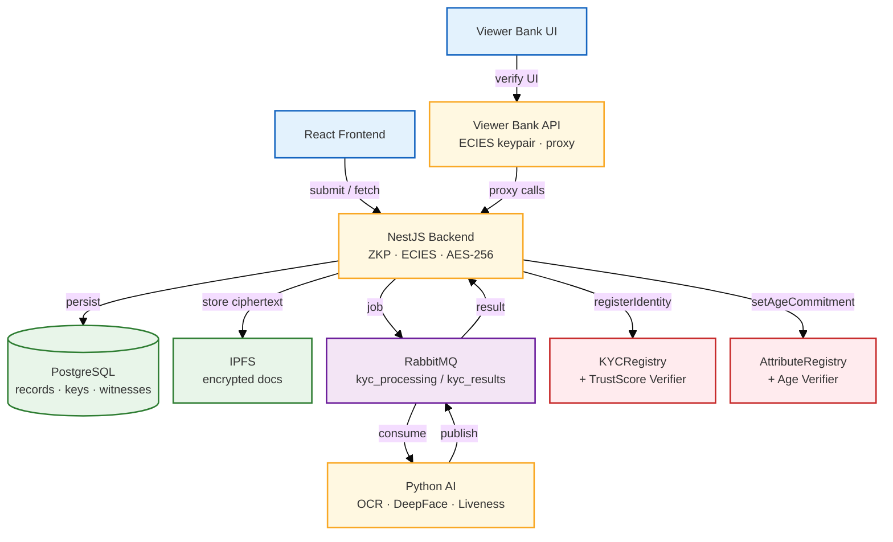

```mermaid
 %%{init: {'theme':'base', 'themeVariables': {'fontSize':'12px'}, 'flowchart': {'nodeSpacing':15, 'rankSpacing':30}}}%%
graph TB

    FE["React Frontend"]
    VFE["Viewer Bank UI"]

    BE["NestJS Backend\nZKP · ECIES · AES-256"]
    AI["Python AI\nOCR · DeepFace · Liveness"]
    VBE["Viewer Bank API\nECIES keypair · proxy"]

    DB[("PostgreSQL\nrecords · keys · witnesses")]
    IPFS["IPFS\nencrypted docs"]

    MQ["RabbitMQ\nkyc_processing / kyc_results"]

    KR["KYCRegistry\n+ TrustScore Verifier"]
    AR["AttributeRegistry\n+ Age Verifier"]

    FE -->|submit / fetch| BE
    VFE -->|verify UI| VBE
    VBE -->|proxy calls| BE

    BE -->|job| MQ -->|result| BE
    MQ -->|consume| AI -->|publish| MQ

    BE -->|persist| DB
    BE -->|store ciphertext| IPFS

    BE -->|registerIdentity| KR
    BE -->|setAgeCommitment| AR

    classDef ui    fill:#E3F2FD,stroke:#1565C0,stroke-width:1.5px
    classDef app   fill:#FFF8E1,stroke:#F9A825,stroke-width:1.5px
    classDef data  fill:#E8F5E9,stroke:#2E7D32,stroke-width:1.5px
    classDef mq    fill:#F3E5F5,stroke:#6A1B9A,stroke-width:1.5px
    classDef chain fill:#FFEBEE,stroke:#C62828,stroke-width:1.5px

    class FE,VFE ui
    class BE,AI,VBE app
    class DB,IPFS data
    class MQ mq
    class KR,AR chain
 
```
