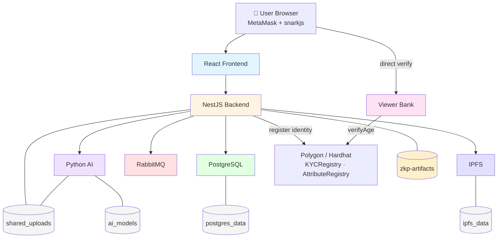

```mermaid
 graph TD
    USER[👤 User Browser\nMetaMask + snarkjs]
    C6[React Frontend]
    C4[NestJS Backend]
    C5[Python AI]
    C1[PostgreSQL]
    C2[RabbitMQ]
    C3[IPFS]
    C7[Viewer Bank]
    BC[Polygon / Hardhat\nKYCRegistry · AttributeRegistry]
    V1[(postgres_data)]
    V2[(ipfs_data)]
    V3[(shared_uploads)]
    V4[(ai_models)]
    V5[(zkp-artifacts)]

    USER --> C6 --> C4
    C4 --> C5
    C4 --> C1 & C2 & C3
    C4 -->|register identity| BC
    C7 -->|verifyAge| BC
    USER -->|direct verify| C7
    C1 --- V1
    C3 --- V2
    C4 --- V3 & V5
    C5 --- V3 & V4

    style C1 fill:#e1ffe1
    style C2 fill:#ffe1e1
    style C3 fill:#e1e1ff
    style C4 fill:#fff4e1
    style C5 fill:#f0e1ff
    style C6 fill:#e1f5ff
    style C7 fill:#ffe1f5
    style V1 fill:#f5f5f5
    style V2 fill:#f5f5f5
    style V3 fill:#f5f5f5
    style V4 fill:#f5f5f5
    style V5 fill:#fff0cc

```
