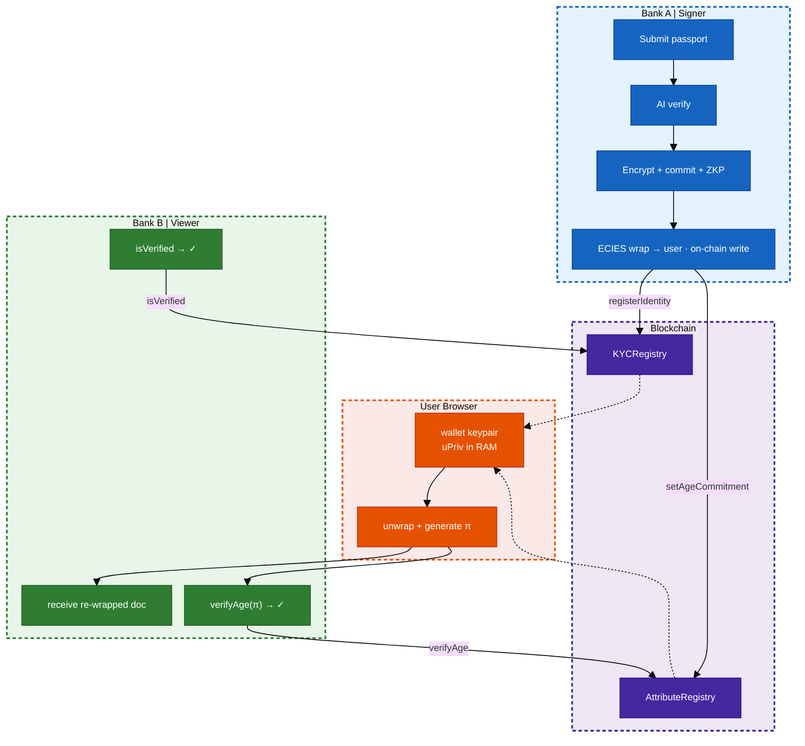

```mermaid
 %%{init: {'theme':'base', 'themeVariables': {'fontSize':'11px'}, 'flowchart': {'nodeSpacing':15, 'rankSpacing':30}}}%%
graph TB

    subgraph BANKA["Bank A  |  Signer"]
        direction TB
        A1["Submit passport"] --> A2["AI verify"]
        A2 --> A3["Encrypt + commit + ZKP"]
        A3 --> A4["ECIES wrap → user · on-chain write"]
    end

    subgraph CHAIN["Blockchain"]
        direction LR
        KR["KYCRegistry"]
        AR["AttributeRegistry"]
    end

    subgraph USER["User Browser"]
        direction TB
        UB["wallet keypair\nuPriv in RAM"]
        UNW["unwrap + generate π"]
        UB --> UNW
    end

    subgraph BANKB["Bank B  |  Viewer"]
        direction TB
        B2["isVerified → ✓"]
        B4["receive re-wrapped doc"]
        B5["verifyAge(π) → ✓"]
    end

    A4 -->|registerIdentity| KR
    A4 -->|setAgeCommitment| AR
    KR -.-> UB
    AR -.-> UB
    B2 -->|isVerified| KR
    UNW --> B4 & B5
    B5 -->|verifyAge| AR

    classDef signer fill:#1565C0,stroke:#0D47A1,color:#fff,stroke-width:1px
    classDef chain  fill:#4527A0,stroke:#311B92,color:#fff,stroke-width:1px
    classDef user   fill:#E65100,stroke:#BF360C,color:#fff,stroke-width:1px
    classDef viewer fill:#2E7D32,stroke:#1B5E20,color:#fff,stroke-width:1px

    class A1,A2,A3,A4 signer
    class KR,AR chain
    class UB,UNW user
    class B2,B4,B5 viewer

    style BANKA fill:#E3F2FD,stroke:#1565C0,stroke-width:2px,stroke-dasharray:4 3
    style CHAIN fill:#EDE7F6,stroke:#4527A0,stroke-width:2px,stroke-dasharray:4 3
    style USER  fill:#FBE9E7,stroke:#E65100,stroke-width:2px,stroke-dasharray:4 3
    style BANKB fill:#E8F5E9,stroke:#2E7D32,stroke-width:2px,stroke-dasharray:4 3
 
```
