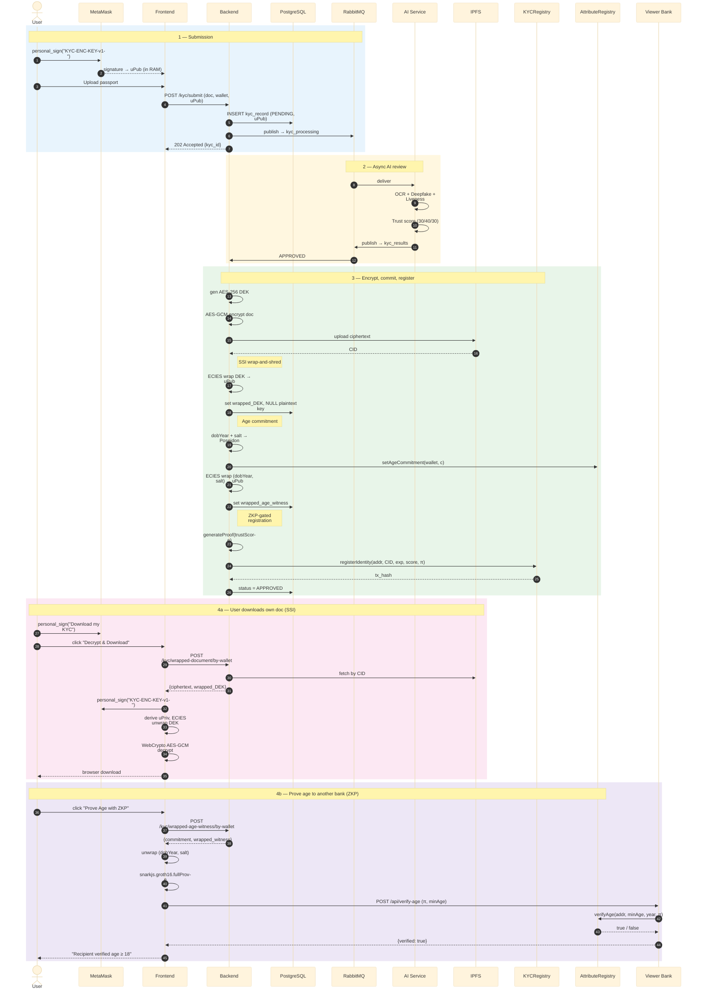

```mermaid
 %%{init: {'theme':'base', 'themeVariables': {'fontSize':'15px'}, 'sequence': {'actorMargin':55, 'messageMargin':38, 'noteMargin':10, 'wrap':true}}}%%
sequenceDiagram
    autonumber
    actor User
    participant W as MetaMask
    participant FE as Frontend
    participant BE as Backend
    participant DB as PostgreSQL
    participant MQ as RabbitMQ
    participant AI as AI Service
    participant IPFS
    participant KR as KYCRegistry
    participant AR as AttributeRegistry
    participant VB as Viewer Bank

    rect rgb(232, 244, 253)
    Note over User,MQ: 1 — Submission
    User->>W: personal_sign("KYC-ENC-KEY-v1")
    W-->>FE: signature → uPub (in RAM)
    User->>FE: Upload passport
    FE->>BE: POST /kyc/submit (doc, wallet, uPub)
    BE->>DB: INSERT kyc_record (PENDING, uPub)
    BE->>MQ: publish → kyc_processing
    BE-->>FE: 202 Accepted {kyc_id}
    end

    rect rgb(255, 247, 224)
    Note over MQ,AI: 2 — Async AI review
    MQ->>AI: deliver
    AI->>AI: OCR + Deepfake + Liveness
    AI->>AI: Trust score (30/40/30)
    AI->>MQ: publish → kyc_results
    MQ->>BE: APPROVED
    end

    rect rgb(232, 245, 233)
    Note over BE,KR: 3 — Encrypt, commit, register
    BE->>BE: gen AES-256 DEK
    BE->>BE: AES-GCM encrypt doc
    BE->>IPFS: upload ciphertext
    IPFS-->>BE: CID
    Note right of BE: SSI wrap-and-shred
    BE->>BE: ECIES wrap DEK → uPub
    BE->>DB: set wrapped_DEK, NULL plaintext key
    Note right of BE: Age commitment
    BE->>BE: dobYear + salt → Poseidon
    BE->>AR: setAgeCommitment(wallet, c)
    BE->>BE: ECIES wrap (dobYear, salt) → uPub
    BE->>DB: set wrapped_age_witness
    Note right of BE: ZKP-gated registration
    BE->>BE: generateProof(trustScore)
    BE->>KR: registerIdentity(addr, CID, exp, score, π)
    KR-->>BE: tx_hash
    BE->>DB: status = APPROVED
    end

    rect rgb(252, 232, 243)
    Note over User,IPFS: 4a — User downloads own doc (SSI)
    User->>W: personal_sign("Download my KYC")
    User->>FE: click "Decrypt & Download"
    FE->>BE: POST /kyc/wrapped-document/by-wallet
    BE->>IPFS: fetch by CID
    BE-->>FE: {ciphertext, wrapped_DEK}
    FE->>W: personal_sign("KYC-ENC-KEY-v1")
    FE->>FE: derive uPriv, ECIES unwrap DEK
    FE->>FE: WebCrypto AES-GCM decrypt
    FE-->>User: browser download
    end

    rect rgb(237, 231, 246)
    Note over User,AR: 4b — Prove age to another bank (ZKP)
    User->>FE: click "Prove Age with ZKP"
    FE->>BE: POST /kyc/wrapped-age-witness/by-wallet
    BE-->>FE: {commitment, wrapped_witness}
    FE->>FE: unwrap (dobYear, salt)
    FE->>FE: snarkjs.groth16.fullProve
    FE->>VB: POST /api/verify-age (π, minAge)
    VB->>AR: verifyAge(addr, minAge, year, π)
    AR-->>VB: true / false
    VB-->>FE: {verified: true}
    FE-->>User: "Recipient verified age ≥ 18"
    end
  
```
