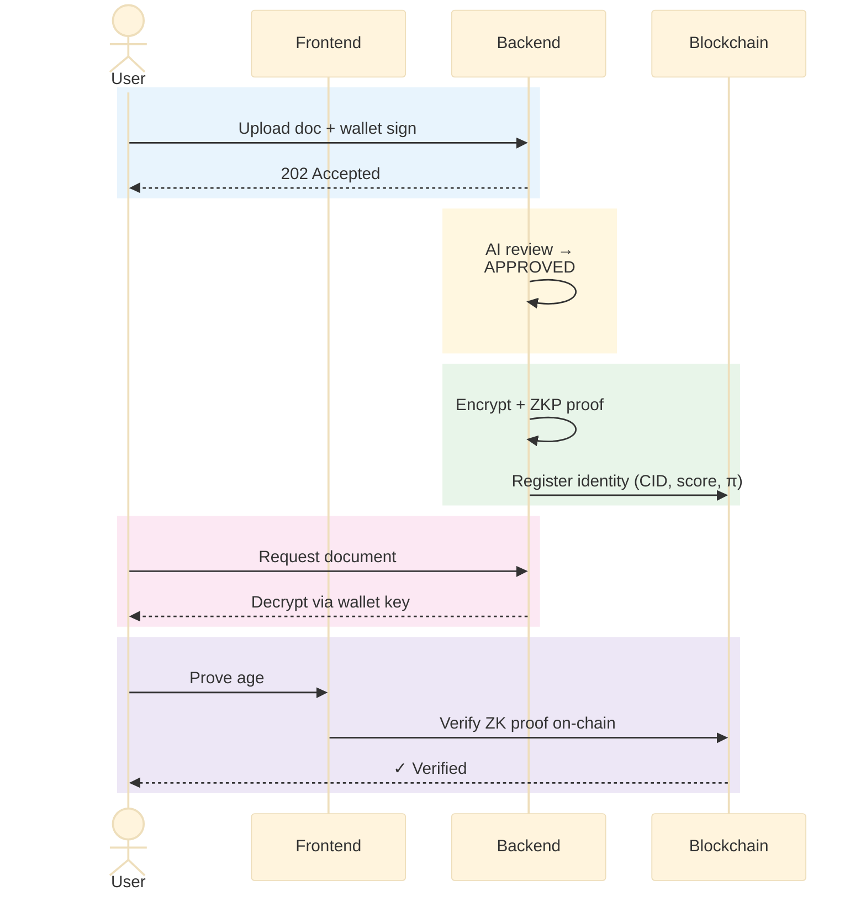

```mermaid
%%{init: {'theme':'base', 'themeVariables': {'fontSize':'14px'}, 'sequence': {'actorMargin':45, 'messageMargin':25, 'wrap':true}}}%%
sequenceDiagram
    actor User
    participant FE as Frontend
    participant BE as Backend
    participant Chain as Blockchain

    rect rgb(232, 244, 253)
    User->>BE: Upload doc + wallet sign
    BE-->>User: 202 Accepted
    end

    rect rgb(255, 247, 224)
    BE->>BE: AI review → APPROVED
    end

    rect rgb(232, 245, 233)
    BE->>BE: Encrypt + ZKP proof
    BE->>Chain: Register identity (CID, score, π)
    end

    rect rgb(252, 232, 243)
    User->>BE: Request document
    BE-->>User: Decrypt via wallet key
    end

    rect rgb(237, 231, 246)
    User->>FE: Prove age
    FE->>Chain: Verify ZK proof on-chain
    Chain-->>User: ✓ Verified
    end  
```
