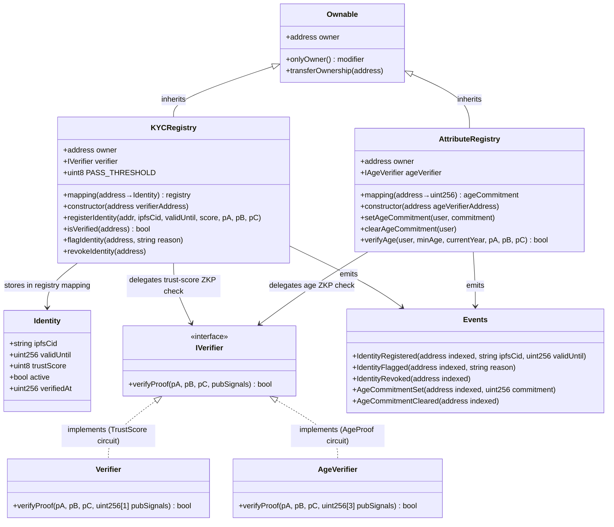

```mermaid
%% MODIFIED_CLAUDE: added `direction TB` so mermaid renders the class hierarchy top-to-bottom (portrait) instead of the default side-by-side flat layout that produced 8192x2078.
classDiagram
    direction TB

    class KYCRegistry {
        +address owner
        +IVerifier verifier
        +uint8 PASS_THRESHOLD
        +mapping(address→Identity) registry
        +constructor(address verifierAddress)
        +registerIdentity(addr, ipfsCid, validUntil, score, pA, pB, pC)
        +isVerified(address) bool
        +flagIdentity(address, string reason)
        +revokeIdentity(address)
    }

    class Identity {
        +string ipfsCid
        +uint256 validUntil
        +uint8 trustScore
        +bool active
        +uint256 verifiedAt
    }

    class AttributeRegistry {
        +address owner
        +IAgeVerifier ageVerifier
        +mapping(address→uint256) ageCommitment
        +constructor(address ageVerifierAddress)
        +setAgeCommitment(user, commitment)
        +clearAgeCommitment(user)
        +verifyAge(user, minAge, currentYear, pA, pB, pC) bool
    }

    class IVerifier {
        <<interface>>
        +verifyProof(pA, pB, pC, pubSignals) bool
    }

    class Verifier {
        +verifyProof(pA, pB, pC, uint256[1] pubSignals) bool
    }

    class AgeVerifier {
        +verifyProof(pA, pB, pC, uint256[3] pubSignals) bool
    }

    class Ownable {
        +address owner
        +onlyOwner() modifier
        +transferOwnership(address)
    }

    class Events {
        +IdentityRegistered(address indexed, string ipfsCid, uint256 validUntil)
        +IdentityFlagged(address indexed, string reason)
        +IdentityRevoked(address indexed)
        +AgeCommitmentSet(address indexed, uint256 commitment)
        +AgeCommitmentCleared(address indexed)
    }

    Ownable <|-- KYCRegistry : inherits
    Ownable <|-- AttributeRegistry : inherits

    KYCRegistry --> Identity : stores in registry mapping
    KYCRegistry --> IVerifier : delegates trust-score ZKP check
    KYCRegistry --> Events : emits

    AttributeRegistry --> IVerifier : delegates age ZKP check
    AttributeRegistry --> Events : emits

    IVerifier <|.. Verifier : implements (TrustScore circuit)
    IVerifier <|.. AgeVerifier : implements (AgeProof circuit)
```
