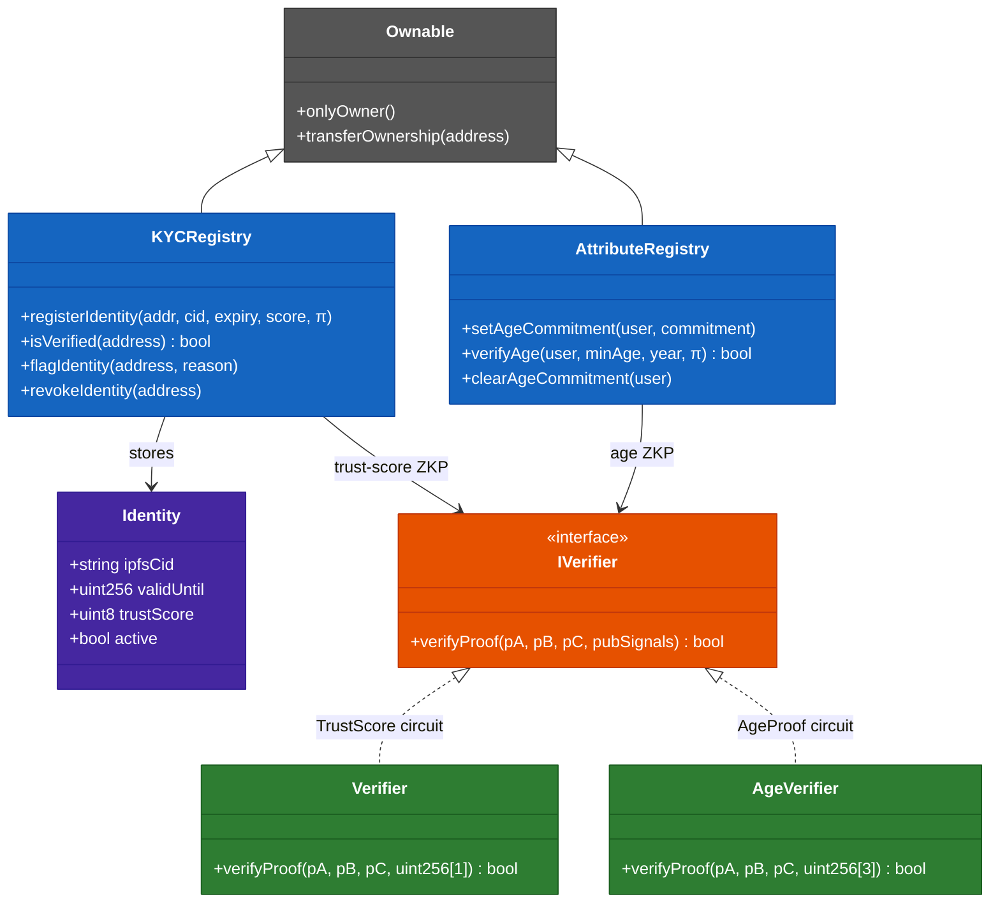

```mermaid
 
classDiagram
    direction TB

    class KYCRegistry {
        +registerIdentity(addr, cid, expiry, score, π)
        +isVerified(address) bool
        +flagIdentity(address, reason)
        +revokeIdentity(address)
    }

    class AttributeRegistry {
        +setAgeCommitment(user, commitment)
        +verifyAge(user, minAge, year, π) bool
        +clearAgeCommitment(user)
    }

    class Identity {
        +string ipfsCid
        +uint256 validUntil
        +uint8 trustScore
        +bool active
    }

    class IVerifier {
        <<interface>>
        +verifyProof(pA, pB, pC, pubSignals) bool
    }

    class Verifier {
        +verifyProof(pA, pB, pC, uint256[1]) bool
    }

    class AgeVerifier {
        +verifyProof(pA, pB, pC, uint256[3]) bool
    }

    class Ownable {
        +onlyOwner()
        +transferOwnership(address)
    }

    Ownable <|-- KYCRegistry
    Ownable <|-- AttributeRegistry
    KYCRegistry --> Identity : stores
    KYCRegistry --> IVerifier : trust-score ZKP
    AttributeRegistry --> IVerifier : age ZKP
    IVerifier <|.. Verifier : TrustScore circuit
    IVerifier <|.. AgeVerifier : AgeProof circuit

    style KYCRegistry    fill:#1565C0,stroke:#0D47A1,color:#fff
    style AttributeRegistry fill:#1565C0,stroke:#0D47A1,color:#fff
    style Identity       fill:#4527A0,stroke:#311B92,color:#fff
    style IVerifier      fill:#E65100,stroke:#BF360C,color:#fff
    style Verifier       fill:#2E7D32,stroke:#1B5E20,color:#fff
    style AgeVerifier    fill:#2E7D32,stroke:#1B5E20,color:#fff
    style Ownable        fill:#555555,stroke:#333333,color:#fff
 
```
