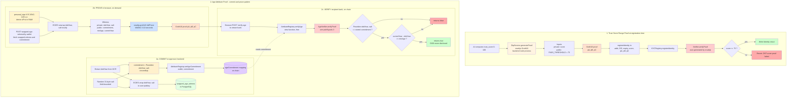

```mermaid
%% Zero-knowledge proof flows: (1) trust-score range proof generated server-side at registration; (2) age attribute proof generated client-side in the browser at verifier-query time (Piper et al. 2025 commit-and-prove pattern).
graph TB
      subgraph "1. Trust Score Range Proof at registration time"
          TS_AI[AI computes trust_score 0-100]
          TS_GEN[ZkpService.generateProof<br/>snarkjs Groth16<br/>backend node process]
          TS_INPUTS[Inputs<br/>private: score<br/>public: PASS_THRESHOLD = 75]
          TS_PROOF[Groth16 proof<br/>pA, pB, pC]
          TS_TX[registerIdentity tx<br/>addr, CID, expiry, score, pA, pB, pC]
          TS_KR[KYCRegistry.registerIdentity]
          TS_VER[Verifier.verifyProof<br/>auto-generated by snarkjs]
          TS_OK{score &gt;= 75 ?}
          TS_WRITE[Write Identity struct]
          TS_REVERT[Revert: ZKP score proof failed]

          TS_AI --> TS_GEN
          TS_GEN --> TS_INPUTS
          TS_INPUTS --> TS_PROOF
          TS_PROOF --> TS_TX
          TS_TX --> TS_KR
          TS_KR --> TS_VER
          TS_VER --> TS_OK
          TS_OK -->|yes| TS_WRITE
          TS_OK -->|no| TS_REVERT
      end

      subgraph "2. Age Attribute Proof - commit and prove pattern"

          subgraph "2a. COMMIT at approval, backend"
              AP_DOB[Extract dobYear from OCR]
              AP_SALT[Random 31-byte salt<br/>field-bounded]
              AP_POSEIDON[commitment = Poseidon dobYear, salt<br/>circomlibjs]
              AP_TX[AttributeRegistry.setAgeCommitment<br/>wallet, commitment]
              AP_AR[(ageCommitment mapping<br/>on chain)]
              AP_WRAP[ECIES wrap dobYear, salt<br/>to user pubkey]
              AP_DB[(wrapped_age_witness<br/>in PostgreSQL)]

              AP_DOB --> AP_POSEIDON
              AP_SALT --> AP_POSEIDON
              AP_POSEIDON --> AP_TX
              AP_TX --> AP_AR
              AP_DOB --> AP_WRAP
              AP_SALT --> AP_WRAP
              AP_WRAP --> AP_DB
          end

          subgraph "2b. PROVE in browser, on demand"
              PR_SIGN[personal_sign KYC-ENC-KEY-v1<br/>derive uPriv in RAM]
              PR_FETCH[POST wrapped-age-witness/by-wallet<br/>fetch wrapped witness and commitment]
              PR_UNWRAP[ECIES unwrap dobYear, salt locally]
              PR_INPUT[Witness<br/>private: dobYear, salt<br/>public: commitment, minAge, currentYear]
              PR_PROVE[snarkjs.groth16.fullProve<br/>WASM, 5-10 seconds]
              PR_PROOF[Groth16 proof pA, pB, pC]

              PR_SIGN --> PR_UNWRAP
              PR_FETCH --> PR_UNWRAP
              PR_UNWRAP --> PR_INPUT
              PR_INPUT --> PR_PROVE
              PR_PROVE --> PR_PROOF
          end

          subgraph "2c. VERIFY recipient bank, on chain"
              VR_POST[Browser POST /verify-age<br/>to viewer bank]
              VR_CALL[AttributeRegistry.verifyAge<br/>view function, free]
              VR_VER[AgeVerifier.verifyProof<br/>uint pubSignals 3]
              VR_CHECK1{Poseidon dobYear, salt<br/>== stored commitment ?}
              VR_CHECK2{currentYear - dobYear<br/>&gt;= minAge ?}
              VR_OK[returns true<br/>DOB never disclosed]
              VR_FAIL[returns false]

              PR_PROOF --> VR_POST
              VR_POST --> VR_CALL
              VR_CALL --> VR_VER
              VR_VER --> VR_CHECK1
              VR_CHECK1 -->|yes| VR_CHECK2
              VR_CHECK1 -->|no| VR_FAIL
              VR_CHECK2 -->|yes| VR_OK
              VR_CHECK2 -->|no| VR_FAIL
          end
      end

      AP_AR -.->|reads commitment| VR_CALL

      style TS_GEN fill:#fff4e1
      style TS_PROOF fill:#ffe1cc
      style TS_VER fill:#ffcccc
      style TS_WRITE fill:#ccffcc
      style TS_REVERT fill:#ffaaaa

      style AP_POSEIDON fill:#fff0cc
      style AP_AR fill:#e1ccff
      style AP_DB fill:#e1ffe1

      style PR_SIGN fill:#fff4cc
      style PR_PROVE fill:#cce1ff
      style PR_PROOF fill:#ffe1cc

      style VR_VER fill:#ffcccc
      style VR_OK fill:#ccffcc
      style VR_FAIL fill:#ffaaaa
```
