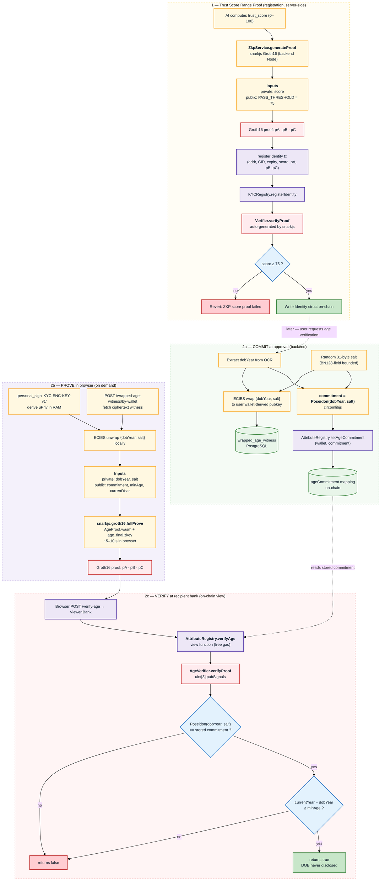

```mermaid
%%{init: {'theme':'base', 'themeVariables': {'fontSize':'14px', 'fontFamily':'Arial'}, 'flowchart': {'nodeSpacing':25, 'rankSpacing':45}}}%%
graph TB
    subgraph REG["1 — Trust Score Range Proof (registration, server-side)"]
        direction TB
        TS_AI["AI computes trust_score (0–100)"]
        TS_GEN["<b>ZkpService.generateProof</b><br/>snarkjs Groth16 (backend Node)"]
        TS_INPUTS["<b>Inputs</b><br/>private: score<br/>public: PASS_THRESHOLD = 75"]
        TS_PROOF["Groth16 proof: pA · pB · pC"]
        TS_TX["registerIdentity tx<br/>(addr, CID, expiry, score, pA, pB, pC)"]
        TS_KR["KYCRegistry.registerIdentity"]
        TS_VER["<b>Verifier.verifyProof</b><br/>auto-generated by snarkjs"]
        TS_OK{"score ≥ 75 ?"}
        TS_WRITE["Write Identity struct on-chain"]
        TS_REVERT["Revert: ZKP score proof failed"]

        TS_AI --> TS_GEN --> TS_INPUTS --> TS_PROOF --> TS_TX
        TS_TX --> TS_KR --> TS_VER --> TS_OK
        TS_OK -- "yes" --> TS_WRITE
        TS_OK -- "no"  --> TS_REVERT
    end

    subgraph COMMIT["2a — COMMIT at approval (backend)"]
        direction TB
        AP_DOB["Extract dobYear from OCR"]
        AP_SALT["Random 31-byte salt<br/>(BN128-field bounded)"]
        AP_POSEIDON["<b>commitment = Poseidon(dobYear, salt)</b><br/>circomlibjs"]
        AP_TX["AttributeRegistry.setAgeCommitment<br/>(wallet, commitment)"]
        AP_AR[("ageCommitment mapping<br/>on-chain")]
        AP_WRAP["ECIES wrap {dobYear, salt}<br/>to user wallet-derived pubkey"]
        AP_DB[("wrapped_age_witness<br/>PostgreSQL")]

        AP_DOB --> AP_POSEIDON
        AP_SALT --> AP_POSEIDON
        AP_POSEIDON --> AP_TX --> AP_AR
        AP_DOB --> AP_WRAP
        AP_SALT --> AP_WRAP
        AP_WRAP --> AP_DB
    end

    subgraph PROVE["2b — PROVE in browser (on demand)"]
        direction TB
        PR_SIGN["personal_sign 'KYC-ENC-KEY-v1'<br/>derive uPriv in RAM"]
        PR_FETCH["POST /wrapped-age-witness/by-wallet<br/>fetch ciphertext witness"]
        PR_UNWRAP["ECIES unwrap {dobYear, salt} locally"]
        PR_INPUT["<b>Inputs</b><br/>private: dobYear, salt<br/>public: commitment, minAge, currentYear"]
        PR_PROVE["<b>snarkjs.groth16.fullProve</b><br/>AgeProof.wasm + age_final.zkey<br/>~5–10 s in browser"]
        PR_PROOF["Groth16 proof: pA · pB · pC"]

        PR_SIGN --> PR_UNWRAP
        PR_FETCH --> PR_UNWRAP
        PR_UNWRAP --> PR_INPUT --> PR_PROVE --> PR_PROOF
    end

    subgraph VERIFY["2c — VERIFY at recipient bank (on-chain view)"]
        direction TB
        VR_POST["Browser POST /verify-age → Viewer Bank"]
        VR_CALL["<b>AttributeRegistry.verifyAge</b><br/>view function (free gas)"]
        VR_VER["<b>AgeVerifier.verifyProof</b><br/>uint[3] pubSignals"]
        VR_CHECK1{"Poseidon(dobYear, salt)<br/>== stored commitment ?"}
        VR_CHECK2{"currentYear − dobYear<br/>≥ minAge ?"}
        VR_OK["returns true<br/>DOB never disclosed"]
        VR_FAIL["returns false"]

        VR_POST --> VR_CALL --> VR_VER --> VR_CHECK1
        VR_CHECK1 -- "yes" --> VR_CHECK2
        VR_CHECK1 -- "no"  --> VR_FAIL
        VR_CHECK2 -- "yes" --> VR_OK
        VR_CHECK2 -- "no"  --> VR_FAIL
    end

    %% Invisible ordering — forces subgraphs to stack vertically
    REG ~~~ COMMIT
    COMMIT ~~~ PROVE
    PROVE ~~~ VERIFY

    %% Cross-section visible links
    TS_WRITE -. "later — user requests age verification" .-> AP_DOB
    PR_PROOF --> VR_POST
    AP_AR -. "reads stored commitment" .-> VR_CALL

    classDef compute fill:#FFF8E1,stroke:#F9A825,stroke-width:1.5px,color:#0D1B2A
    classDef proof   fill:#FFEBEE,stroke:#C62828,stroke-width:1.5px,color:#0D1B2A
    classDef store   fill:#E8F5E9,stroke:#2E7D32,stroke-width:1.5px,color:#0D1B2A
    classDef chain   fill:#EDE7F6,stroke:#4527A0,stroke-width:1.5px,color:#0D1B2A
    classDef ok      fill:#C8E6C9,stroke:#2E7D32,stroke-width:1.5px,color:#0D1B2A
    classDef fail    fill:#FFCDD2,stroke:#B71C1C,stroke-width:1.5px,color:#0D1B2A
    classDef decide  fill:#E3F2FD,stroke:#1565C0,stroke-width:1.5px,color:#0D1B2A

    class TS_AI,TS_GEN,TS_INPUTS,AP_DOB,AP_SALT,AP_POSEIDON,AP_WRAP,PR_SIGN,PR_FETCH,PR_UNWRAP,PR_INPUT,PR_PROVE compute
    class TS_PROOF,TS_VER,PR_PROOF,VR_VER proof
    class AP_DB,AP_AR store
    class TS_TX,TS_KR,AP_TX,VR_POST,VR_CALL chain
    class TS_WRITE,VR_OK ok
    class TS_REVERT,VR_FAIL fail
    class TS_OK,VR_CHECK1,VR_CHECK2 decide

    style REG    fill:#FFFDF5,stroke:#FFD54F,stroke-dasharray:3 3
    style COMMIT fill:#F5FBF5,stroke:#A5D6A7,stroke-dasharray:3 3
    style PROVE  fill:#F4F1FB,stroke:#B39DDB,stroke-dasharray:3 3
    style VERIFY fill:#FFF5F5,stroke:#EF9A9A,stroke-dasharray:3 3
```
