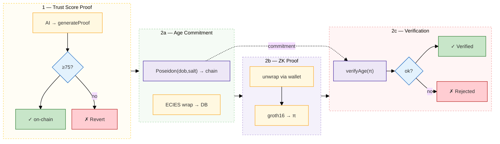

```mermaid
 %%{init: {'theme':'base', 'themeVariables': {'fontSize':'12px'}, 'flowchart': {'nodeSpacing':15, 'rankSpacing':20}}}%%
graph LR

    subgraph REG["1 — Trust Score Proof"]
        R1["AI → generateProof"] --> R2{"≥75?"} --> R3["✓ on-chain"]
        R2 -- no --> R4["✗ Revert"]
    end

    subgraph COMMIT["2a — Age Commitment"]
        C1["Poseidon(dob,salt) → chain"]
        C2["ECIES wrap → DB"]
    end

    subgraph PROVE["2b — ZK Proof"]
        P1["unwrap via wallet"] --> P2["groth16 → π"]
    end

    subgraph VERIFY["2c — Verification"]
        V1["verifyAge(π)"] --> V2{"ok?"} --> V3["✓ Verified"]
        V2 -- no --> V4["✗ Rejected"]
    end

    REG --> COMMIT --> PROVE --> VERIFY
    C1 -.->|commitment| V1

    classDef compute fill:#FFF8E1,stroke:#F9A825,stroke-width:1px
    classDef chain   fill:#EDE7F6,stroke:#4527A0,stroke-width:1px
    classDef ok      fill:#C8E6C9,stroke:#2E7D32,stroke-width:1px
    classDef fail    fill:#FFCDD2,stroke:#B71C1C,stroke-width:1px
    classDef decide  fill:#E3F2FD,stroke:#1565C0,stroke-width:1px

    class R1,P1,P2,C2 compute
    class R3,C1,V1 chain
    class R3,V3 ok
    class R4,V4 fail
    class R2,V2 decide

    style REG    fill:#FFFDF5,stroke:#FFD54F,stroke-dasharray:3 3
    style COMMIT fill:#F5FBF5,stroke:#A5D6A7,stroke-dasharray:3 3
    style PROVE  fill:#F4F1FB,stroke:#B39DDB,stroke-dasharray:3 3
    style VERIFY fill:#FFF5F5,stroke:#EF9A9A,stroke-dasharray:3 3
 
```
